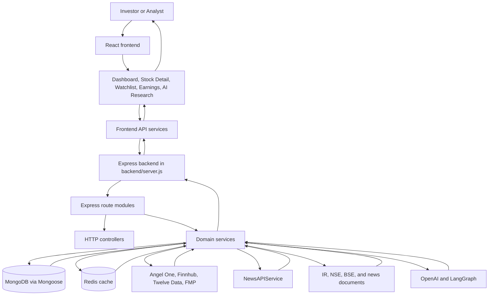
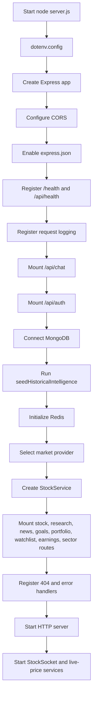
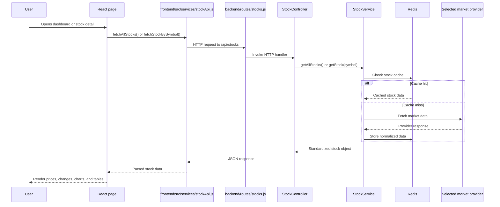
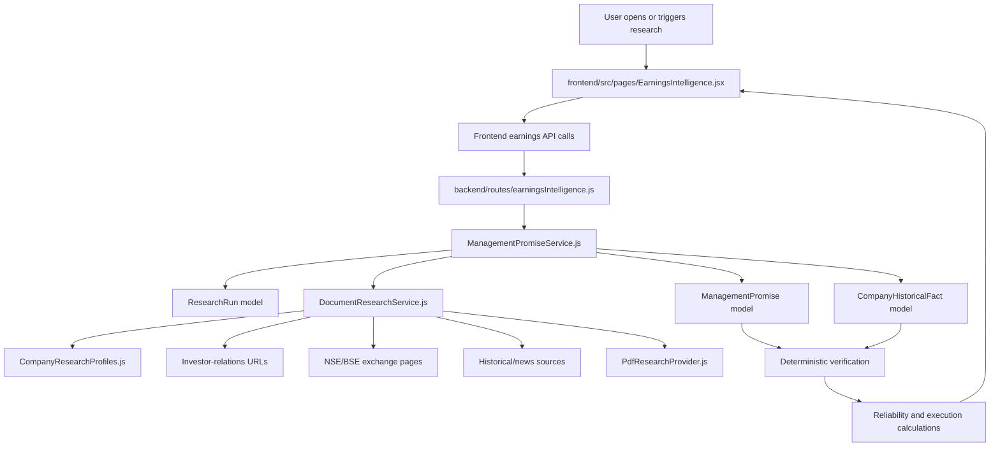
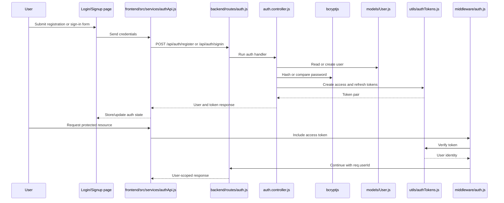
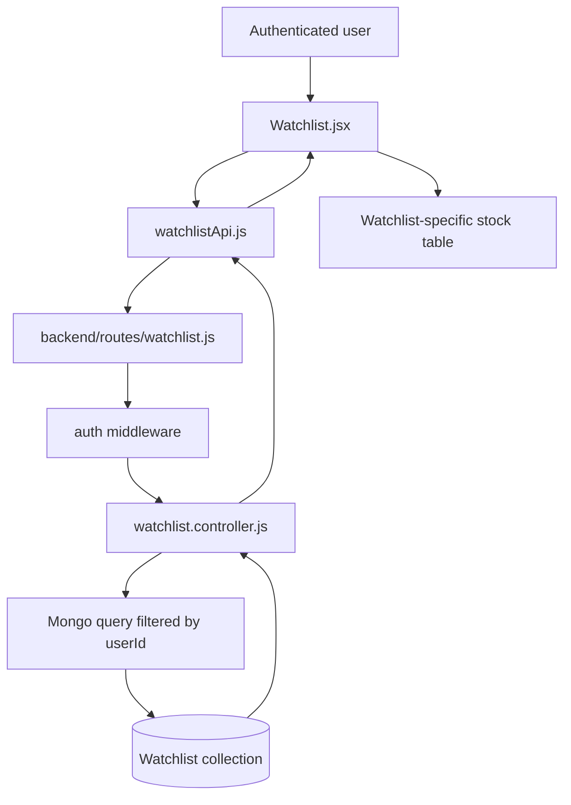
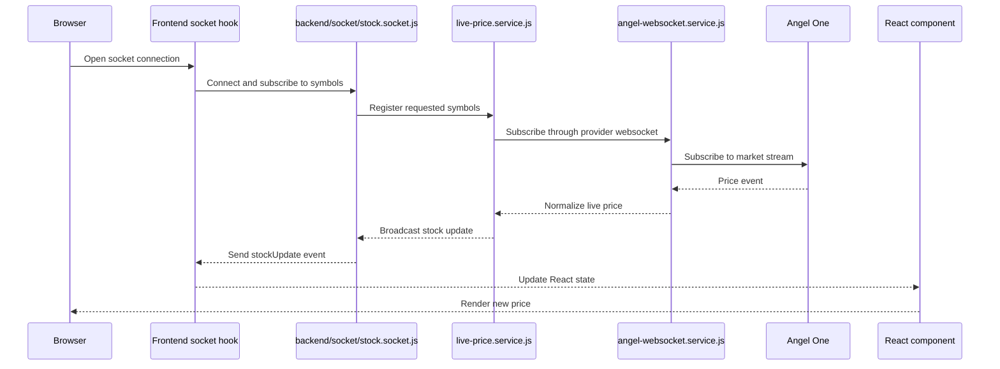
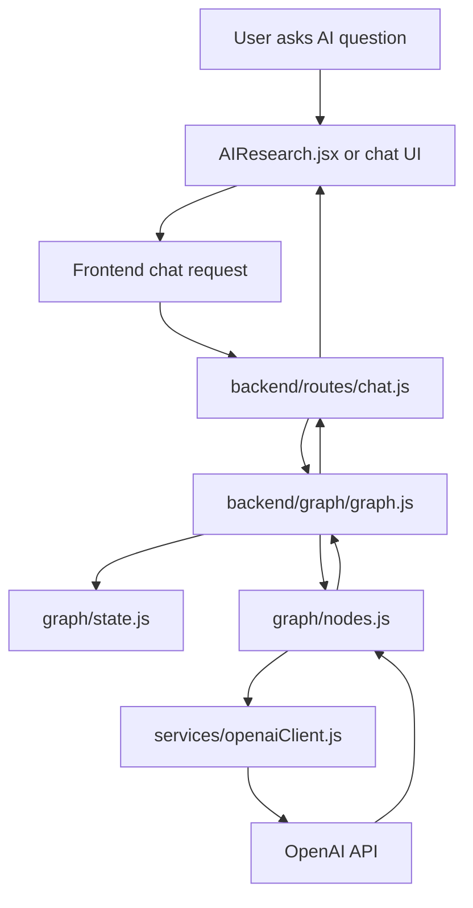

# GrowthSquad Research Terminal
## Phase 1 Architecture and Project Map

This document describes the architecture confirmed from the files currently present in the repository. It intentionally covers Phase 1 only: project identity, major modules, technologies, boundaries, and high-level flows.

---

## 1. What This Project Is

GrowthSquad Research Terminal is an Indian stock-market research platform for investors and analysts.

The repository contains a React frontend and a Node.js/Express backend. The platform combines:

- Live NSE/BSE market data
- Stock dashboards and company details
- Watchlists and portfolios
- News aggregation
- Sector intelligence
- Earnings intelligence
- Historical company facts
- Management-promise tracking
- AI-assisted research and chat
- Authentication
- Real-time market updates
- Investor-relations and exchange-document collection

The primary application is under `Growth-squad-research-/`.

---

## 2. Main Architecture



### Simplified Request/Response View

```text
User action
    |
    v
React page
    |
    v
Frontend service in frontend/src/services/
    |
    v
HTTP request to Express
    |
    v
Route in backend/routes/
    |
    v
Controller or service
    |
    +--> MongoDB through backend/models/
    +--> Redis through backend/utils/redisClient.js
    +--> External provider through backend/providers/
    +--> Research/document pipeline
    +--> OpenAI/LangGraph
    |
    v
JSON response
    |
    v
Frontend state
    |
    v
Rendered UI
```

---

## 3. Repository Roots

```text
Stock_Market_AI/
|
+-- angelone_api/
|   Separate Angel One-related workspace area
|
+-- api_testing/
|   Separate backend/frontend API testing area
|
+-- Growth-squad-research-/
|   Primary application
|   |
|   +-- backend/
|   +-- frontend/
|   +-- memory/
|   +-- test_reports/
|   +-- project documentation
|
+-- tests/
    Workspace-level test area
```

The main runtime application is `Growth-squad-research-/backend` plus `Growth-squad-research-/frontend`.

---

## 4. Technologies Actually Present

### Frontend

Defined in `frontend/package.json`:

- React 19
- React DOM
- React Router DOM 7
- Create React App through CRACO
- Tailwind CSS
- Recharts
- Axios
- Socket.IO client
- Lucide React
- Sonner
- Radix UI components
- React Hook Form
- Zod

### Backend

Defined in `backend/package.json`:

- Node.js ES modules
- Express 5
- Axios
- Mongoose
- MongoDB
- Redis
- Socket.IO
- `ws`
- JSON Web Tokens
- bcryptjs
- OpenAI SDK
- LangChain Core
- LangGraph
- `pdf-parse`
- Angel One SmartAPI SDK
- dotenv
- CORS

### Database and Cache

```text
MongoDB
  Accessed through Mongoose
  Connection started in backend/server.js

Redis
  Initialized in backend/utils/redisClient.js
  Used mainly for stock-data caching
```

---

## 5. Frontend Entry and Routing

```mermaid
flowchart TD
    Browser[Browser]
    Browser --> Index[frontend/src/index.js]
    Index --> Strict[React.StrictMode]
    Strict --> App[frontend/src/App.js]
    App --> AuthProvider[AuthProvider from hooks/useAuth.js]
    AuthProvider --> Router[BrowserRouter]
    Router --> Routes[Routes]

    Routes --> Landing[/]
    Routes --> AuthPages[/login, /signup, /onboarding]
    Routes --> Layout[Layout wrapper]
    Layout --> ProductPages[/dashboard, /watchlist, /portfolio, /news]
    Layout --> Intelligence[/sectors, /earnings, /ai-research]
    Layout --> Stock[/stock/:ticker]
    Layout --> Planning[/goals, /baskets, /sip-planner, /retirement, /net-worth]
    Layout --> Search[/search]
```

### Frontend Entry Files

```text
frontend/src/index.js
    Browser entry point. Renders App.

frontend/src/App.js
    Creates AuthProvider, BrowserRouter, routes, Layout, and Toaster.

frontend/src/components/layout/Layout.jsx
    Application shell around most authenticated/product pages.

frontend/src/config/api.js
    Centralizes the backend base URL.
```

### Frontend Route Groups

```text
Public/entry routes:
  /
  /login
  /signup
  /onboarding

Application routes inside Layout:
  /dashboard
  /watchlist
  /portfolio
  /goals
  /baskets
  /sip-planner
  /retirement
  /net-worth
  /settings
  /news
  /sectors
  /earnings
  /earnings/:symbol
  /earnings-intelligence/:symbol
  /ai-research
  /stock/:ticker
  /search
```

---

## 6. Backend Startup Flow

The backend startup sequence is controlled by `backend/server.js`.



### Provider Selection

`backend/server.js` reads `MARKET_DATA_PROVIDER`.

```text
angel-one / angelone / angel
    -> AngelOneProvider

financialmodelingprep
    -> FinancialModelingPrepProvider

twelve-data / twelvedata
    -> TwelveDataProvider

finnhub-related value
    -> FinnhubProvider

unknown or missing value
    -> AngelOneProvider fallback
```

The current source default is Angel One, even though some older documentation describes Finnhub as primary.

---

## 7. Stock Market Data Flow



### Relevant Files

```text
frontend/src/services/stockApi.js
    Calls stock endpoints and normalizes list/series fields.

backend/routes/stocks.js
    Defines stock HTTP endpoints.

backend/controllers/StockController.js
    Handles HTTP parameters and responses.

backend/services/StockService.js
    Validates symbols, checks Redis, calls providers, enriches results.

backend/providers/AngelOneProvider.js
backend/providers/FinnhubProvider.js
backend/providers/TwelveDataProvider.js
backend/providers/FinancialModelingPrepProvider.js
    External market-data adapters.

backend/utils/constants.js
    Supported symbols, provider configuration, cache TTLs, and constants.
```

---

## 8. Research and Document Data Flow



Research-related files include:

```text
backend/services/ManagementPromiseService.js
backend/research/DocumentResearchService.js
backend/research/ManagementResearchProviders.js
backend/research/PdfResearchProvider.js
backend/research/CompanyResearchProfiles.js
backend/models/ResearchRun.js
backend/models/CompanyHistoricalFact.js
backend/models/ManagementPromise.js
backend/services/ExecutionScoreService.js
```

The current NEWGEN investigation found that exchange pages return static shells or JavaScript-rendered content, while the company IR domain has TLS certificate-chain failures.

---

## 9. Authentication Flow



Relevant files:

```text
frontend/src/hooks/useAuth.js
frontend/src/services/authApi.js
frontend/src/pages/Login.jsx
frontend/src/pages/Signup.jsx
backend/routes/auth.js
backend/controllers/auth.controller.js
backend/middleware/auth.js
backend/utils/authTokens.js
backend/models/User.js
```

The backend uses bcryptjs and JWT. The exact frontend token-storage details should be traced in the authentication phase.

---

## 10. Watchlist Data Boundary



The relevant backend controller queries watchlists using `req.userId`. Symbol additions and removals also include both the watchlist ID and authenticated user ID in the database filter.

Relevant files:

```text
frontend/src/pages/Watchlist.jsx
frontend/src/services/watchlistApi.js
backend/routes/watchlist.js
backend/controllers/watchlist.controller.js
backend/models/Watchlist.js
backend/middleware/auth.js
```

---

## 11. Real-Time Market Updates

The current startup path in `backend/server.js` uses the `socket/` implementation.



There is also an alternate/older ticker implementation:

```text
backend/websocket/ticker.js
frontend/src/hooks/useStockTicker.js
frontend/src/hooks/useStockSocket.js
```

The repository contains both paths. The source of truth for the currently started server is the `StockSocket` path imported in `backend/server.js`.

---

## 12. AI and LLM Locations



The LangGraph structure currently represented in `graph/graph.js` is:

```text
START
  |
  v
chatbot node
  |
  v
END
```

There is also AI-related logic in the earnings research system. That distinction should be traced in depth later:

```text
AI/LLM responsibility:
  Extract or interpret research information.

Code responsibility:
  Validate data, match periods, normalize units, verify outcomes,
  calculate reliability, and calculate execution scores.
```

The frontend AI research page also contains product-level AI research UI and may contain mocked or keyword-routed responses. The exact active path should be confirmed during the frontend and AI phases.

---

## 13. Major Product Areas

```text
Dashboard
  frontend/src/pages/Dashboard.jsx
  Loads stock data, indices, news, and market status.

Stock Detail
  frontend/src/pages/StockDetail.jsx
  Loads a stock, company details, news, charts, and research information.

Watchlist
  frontend/src/pages/Watchlist.jsx
  Loads authenticated watchlists and associated live stock data.

Portfolio
  frontend/src/pages/Portfolio.jsx
  Uses portfolio API and backend portfolio routes/models.

Sector Intelligence
  frontend/src/pages/SectorIntelligence.jsx
  Uses live stocks plus sector-rotation data.

News
  frontend/src/pages/News.jsx
  Uses frontend news service and backend news route/service.

Earnings Intelligence
  frontend/src/pages/EarningsIntelligence.jsx
  Uses research, facts, promises, company history, and research-job endpoints.

AI Research
  frontend/src/pages/AIResearch.jsx
  Provides AI research interaction and connects to the chat/research architecture.

Financial Planning
  Goals, SIP, retirement, net-worth, and investment-basket pages.
```

---

## 14. Current Architecture Caveats

### Documentation versus source code

Some repository documentation describes an older architecture where Finnhub is primary and the frontend is largely mock-data driven. The current source entry point is more authoritative.

For current backend provider selection, inspect:

```text
backend/server.js
backend/providers/
backend/services/StockService.js
```

### Multiple implementations

The repository contains multiple implementations or generations for:

- Market-data providers
- WebSocket systems
- Stock controllers
- Server files
- Frontend mock and live data paths

The active runtime path should always be traced from:

```text
backend/server.js
frontend/src/App.js
```

### What cannot yet be confirmed in Phase 1

The following require deeper tracing in later phases:

- Exact implementation of every frontend token-storage detail
- Exact active frontend WebSocket consumer for each page
- Complete AIResearch response path
- Every database relationship and write operation
- Complete request lifecycle for each user action
- Exact production deployment wiring

---

## 15. Initial Learning Order

```text
Level 1   Project architecture
Level 2   Frontend entry point and routing
Level 3   Frontend API services and request flow
Level 4   Backend server and route mounting
Level 5   Backend services and providers
Level 6   MongoDB models and Redis cache
Level 7   Authentication and user-scoped data
Level 8   Stock-market data
Level 9   News and sector intelligence
Level 10  Earnings Intelligence
Level 11  Document Research Pipeline
Level 12  AI, promises, and verification
Level 13  Reliability and execution score
Level 14  Testing
Level 15  Deployment
```

The next walkthrough phase should begin with the actual folders and important files, starting from the entry points identified above.

---

## Phase 1 Checkpoint

You should now be able to explain this basic chain:

```text
User clicks a feature
    |
    v
React page in frontend/src/pages/
    |
    v
Frontend API service in frontend/src/services/
    |
    v
Express route in backend/routes/
    |
    v
Controller or domain service
    |
    +--> MongoDB model
    +--> Redis cache
    +--> External market/news provider
    +--> Document research pipeline
    +--> OpenAI/LangGraph
    |
    v
JSON response
    |
    v
React state update
    |
    v
UI rendering
```

Phase 1 ends here. No line-by-line explanation or implementation changes are included.
